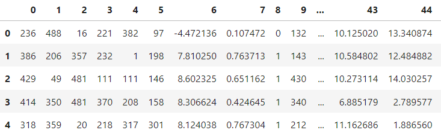

## Regression
In this project the regression model will be implemented to predict target value for test data in internship_hidden_test.csv file based on internship_train.csv file.

## Visualizing the data
The table below displays the training data from the internship_train.csv file.

## Regression models
To select a model for regression, different models were compared by the RMSE metric. 

### Linear Regression model
RMSE: 28.907023187685677

### Random Forest Regressor
RMSE: 0.005195949340273726

### Gradiend Boosting Regressor
RMSE: 11.873200505267594

### Ridge
RMSE: 28.907022860534266

### Support Vector Regression
RMSE: 28.916444841695657

## Modeling
The Random Forest Regressor model was used to obtain predictions. For modeling run the main.py file. The result is saved in the result.csv file. 

## Predictions
The table below displays the predictions in result.csv file.

